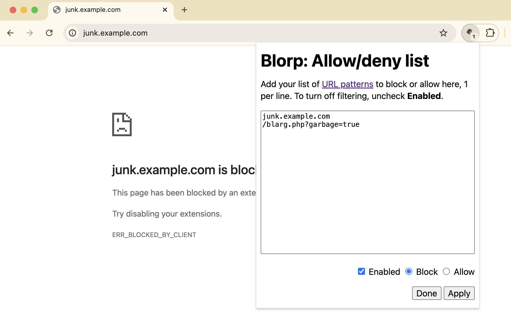

# Blorp

Blorp is the simplest possible content blocker for browsers that use the
Chromium extension API. At your choice, it blocks the loading of URLs that match
any of a list of patterns that you provide, or it allows **only** loading
matching URLs. Blorp’s simplicity makes it efficient and safe.

## Blocking And Allowing URLs

Click on the puzzle piece icon in Chrome’s toolbar, and then on the Blorp **B**
icon in the pop-up that appears. This will raise the **Blorp List**
configuration pop-up. Add `urlFilter`s, 1 per line, that describe URLs you would
like to block. Select either **Block** or **Allow**, and click **Apply**. You
can easily turn filtering on or off by checking and unchecking the **Enabled**
checkbox.

The simplest approach is to give a list of strings, such as domain names or
parts of URLs like paths or query strings. If the string occurs anywhere in a
URL, Blorp will block it from loading. Matching is case-insensitive.

Fancier pattern-matching is possible. For the full details on the syntax of
`urlFilter`s, see [the `declarativeNetRequest`
documentation](https://developer.chrome.com/docs/extensions/reference/declarativeNetRequest/).

## Where To Get Lists Of Patterns?

To create an allow list, just add the sites you like.

Lots of people publish open source URL block lists that you can use.

(I built my list manually, by watching URLs load in Chrome’s Developer Tools,
and it mostly contains domain names. However, I am strange. Don’t end up like
me, kids.)
